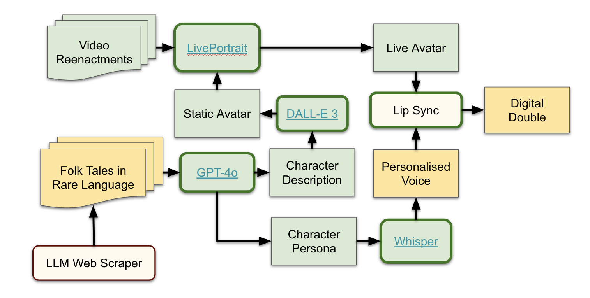

# Fabbia Demo

### Team: Always Late


## Reconnect with your culture & language through stories


### Overview
Fabbia is a project designed to help the Central Asian and Caucasian diaspora reconnect with their culture and language through engaging stories. Our platform leverages AI and gamification to provide scalable content and an immersive learning experience.

### Problem Statement
- **Underserved Languages**: Migrants from Central Asian & Caucasian regions often struggle to maintain their native languages due to a lack of accessible learning tools.
- **Lack of Accessible Learning Tools**: Popular platforms like Duolingo do not cover these languages, and private tutoring is often expensive and inconvenient.
- **Cultural Disconnect**: Migrant communities frequently lack access to communities where they can practice their native languages.

### Fabbia Lessons
- **Nurturing Character Growth**: Lessons designed to foster personal development.
- **Story-Based Puzzles**: Engaging puzzles that teach language through stories.
- **Interactive Learning with a Master Storyteller**: Immersive storytelling sessions.

### Content Generation Pipeline
The main technological challenge for this project is designing a scalable and language-agnostic content and asset generation pipeline. This approach aims to provide an advantage over resource-demanding educational platforms like Duolingo. For the purpose of this hackathon, the pipeline operated in a semi-manual mode. Below, we have included a schematic representation of the flow.



### Legend for Content Generation Pipeline
- **Rounded Rectangles**: These are the tools used in the pipeline.
- **Regular Rectangles**: These represent the data and assets.
- **Beige Boxes**: Components not included in this prototype but planned for future versions.
- **Yellow Boxes**: Components with shortcuts or limited functionality.
- **Green Boxes**: Fully functioning components.

### Prototype
Fabbia is currently in the prototype stage, with ongoing development to enhance its features and user experience.

### How to Run Lesson Demo
To get started with Fabbia, follow these steps:

1. **Set Up the Environment**:
   - Ensure you have Python installed on your system.
   - Install the required packages by running the following command in your terminal:
     ```
     pip install -r requirements.txt
     ```

2. **Configure the OpenAI API Key**:
   - Locate the `.env.example` file in the project directory.
   - Create a new file named `.env` in the same directory.
   - Copy the contents of `.env.example` into `.env`.
   - Replace the placeholder with your actual OpenAI API key:
     ```
     OPENAI_API_KEY=your_actual_api_key_here
     ```

3. **Run the Application**:
   - Launch the application using Streamlit by executing the following command:
     ```
     streamlit run demo.py
     ```
   - This will start the app, and you can access it via your web browser at the URL provided in the terminal.

### Team Members
- **Aiken Bozzhanova**
- **Dameli Bozzhanova**
- **Rauf Kurbanov**

### Conclusion
Fabbia aims to bridge the gap in language learning for the Central Asian and Caucasian diaspora, providing a unique, culturally rich, and engaging platform to reconnect with their heritage.

For more information, please refer to our detailed slides and data points provided above.